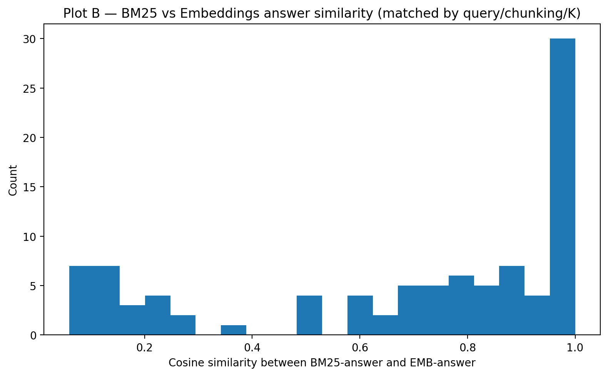

# 📊 RAG Evaluation Report  
**Chunking, Retrieval, and Stability Analysis**

---

## 1. Project Overview

This project evaluates a **Retrieval-Augmented Generation (RAG)** pipeline applied to **long parliamentary debates**.  
The main objective is to analyze how different design choices affect:

- Retrieval quality
- Answer stability
- Faithfulness of generated answers

The evaluation focuses on three core dimensions:

1. Chunking strategy  
2. Retrieval representation (BM25 vs embeddings)  
3. Sensitivity to the number of retrieved chunks (K)

---

## 2. Chunking Methodology (Assigned Method)

### Father–Son (Parent–Child) Chunking

The main chunking strategy used in this project is the **Father–Son (Parent–Child)** method, which was assigned for this evaluation.

Each document is first segmented into **parent chunks**, which group consecutive sentences to preserve broader thematic context.  
Each parent chunk is then subdivided into **child chunks**, which are smaller, sentence-based units with minimal overlap.

This design provides two complementary benefits:

- **Improved recall**: parent chunks ensure that relevant regions of the document are not missed.
- **Improved precision**: child chunks allow retrieval to focus on tightly scoped semantic content.

This hierarchical approach is particularly well suited for long and structured documents such as parliamentary debates.

---

## 3. Large Language Model (LLM)

We used **Qwen 2.5 (3B)** via **Ollama** as the language model in our RAG pipeline.

This choice was motivated by:

- Local and offline execution (full reproducibility)
- Low computational cost and fast inference
- Adequate generation quality when combined with high-quality retrieved context

Since this is a RAG system, overall answer quality depends more on **retrieval quality** than on model size.

---

## 4. Retrieval Representations

Two retrieval approaches were evaluated:

### 4.1 BM25 (Lexical Retrieval)

BM25 relies on exact term matching and is especially effective for:

- Factual questions
- Named entities
- Dates, numbers, and organizations

### 4.2 Dense Embeddings (Semantic Retrieval)

Dense embeddings were generated using **MPNet (`all-mpnet-base-v2`)**.  
This method captures semantic similarity and enables retrieval even when the query is a paraphrase of the source text.
### Practical Note on Embedding Computation

The answer embeddings used for stability and similarity analysis were computed using **Google Colab with GPU acceleration**.

This was necessary because generating dense embeddings with `all-mpnet-base-v2` over hundreds of generated answers is computationally expensive on CPU.  
Using a GPU significantly reduced embedding computation time while ensuring identical results.

Once computed, the embeddings were saved and reused locally for all subsequent analyses and plotting steps.

---

## 5. Choice of K (Number of Retrieved Chunks)

We evaluated **K = 3, 5, and 8**, representing different precision–recall regimes:

- **K = 3**: high precision, limited recall  
- **K = 5**: balanced precision and recall  
- **K = 8**: higher recall, increased risk of noise  

To measure sensitivity to K, we computed **answer stability across K values**, using cosine similarity between generated answers.

---

## 6. Plot A — Stability by Configuration

This plot shows the **mean cosine similarity of answers across different K values**, grouped by configuration.

### Observations

- **Child chunking (Father–Son)** yields the highest stability.
- Fixed-size chunking is significantly less stable, especially with BM25.
- Retrieval representation has less impact than chunking strategy.

### Conclusion

Chunking strategy is the dominant factor influencing answer stability.  
Hierarchical chunking clearly outperforms fixed-size chunking.

---

## 7. Plot C — Stability by Query Type

This plot compares answer stability between **factual** and **conceptual** queries.

### Observations

- Factual queries exhibit slightly higher stability.
- Conceptual queries are more sensitive to retrieval variation.

### Interpretation

Conceptual questions require higher-level reasoning and synthesis, making them more vulnerable to changes in retrieved context.

---

## 8. Plot B — BM25 vs Embeddings Answer Similarity

This histogram shows cosine similarity between answers generated using BM25 retrieval and embedding-based retrieval, for the **same query, chunking strategy, and K**.

### Key Insights

- The distribution is **bimodal**:
  - One peak near 1.0 → nearly identical answers
  - One peak between 0.1 and 0.3 → fundamentally different answers
- This indicates that BM25 and embeddings often retrieve **different contextual evidence**.
---

## Tested Queries and Query IDs

To evaluate the RAG pipeline under realistic conditions, we used a fixed set of **16 test queries**, divided along two axes:

- **Source**: instructor-provided (required) vs student-written (custom)
- **Type**: factual vs conceptual

Each query is associated with a **unique ID**, which is used consistently throughout:
- the stability analysis
- the BM25 vs embedding comparisons
- the qualitative answer evaluation

This allows precise attribution of observed behaviors to specific questions.

---

### Custom Queries (Student-Written)

These queries were designed to reflect realistic user information needs and to test both **fact extraction** and **high-level reasoning**.

#### Factual Custom Queries

| Query ID | Question |
|--------|----------|
| **CUS_F1** | Which countries or regions were mentioned as receiving UK humanitarian aid in the debates? |
| **CUS_F2** | What specific funding amounts (in pounds) were announced for humanitarian assistance, and on what dates? |
| **CUS_F3** | Which ministers or government departments were mentioned as responsible for managing the response to the Sudan crisis? |
| **CUS_F4** | What dates were mentioned regarding decisions to resume or suspend funding to UNRWA? |

These queries require retrieving **precise entities, dates, and numerical values**, making them well-suited for evaluating recall and precision.

---

#### Conceptual Custom Queries

| Query ID | Question |
|--------|----------|
| **CUS_C1** | How do speakers justify humanitarian intervention: moral duty, international law, or national interest? |
| **CUS_C2** | What arguments are made about balancing border control with humanitarian obligations to refugees and asylum seekers? |
| **CUS_C3** | How do speakers frame the relationship between economic stability and national security in the debates? |
| **CUS_C4** | What recurring themes appear when speakers discuss the effectiveness of international organizations (UN, WFP, NGOs) in crisis response? |

These queries require **synthesizing multiple arguments across different speeches**, making them more sensitive to retrieval variation.

---

### Required Queries (Instructor-Provided)

These queries were provided as part of the assignment instructions and ensure **comparability across student submissions**.

#### Factual Required Queries

| Query ID | Question |
|--------|----------|
| **REQ_F1** | On what dates did the British Prime Minister deliver his speech on the defense budget? |
| **REQ_F2** | What was the main argument regarding the immigration bill that was presented? |
| **REQ_F3** | What three industrial sectors were mentioned as the main victims of the new trade policy that was presented? |
| **REQ_F4** | What organizations were mentioned by the speakers as supporting the proposed reform of the health system? |

These questions test the system’s ability to extract **clearly stated factual information** from long debates.

---

#### Conceptual Required Queries

| Query ID | Question |
|--------|----------|
| **REQ_C1** | How does the rhetoric on climate change vary between different speakers; is the emphasis on economic opportunity or existential crisis? |
| **REQ_C2** | What is the central tension that emerges from the speeches between the need for national security and the protection of citizens’ privacy in the digital age? |
| **REQ_C3** | How is the state’s moral responsibility towards refugees and asylum seekers described, and what are the ethical (rather than economic) arguments given for and against their absorption? |
| **REQ_C4** | In what ways did speakers link investment in education to reducing future crime, and was there consensus on this issue? |

These queries are intentionally open-ended and test the RAG system’s ability to produce **grounded, coherent synthesis** rather than simple fact lookup.

---

### Role of Query IDs in the Analysis

The query IDs (e.g., `REQ_C2`, `CUS_F4`) are used consistently in:

- Stability rankings (most stable / most unstable configurations)
- BM25 vs embedding divergence analysis
- Qualitative examples discussed in later sections

This ensures **traceability** between:
- individual questions
- retrieved chunks
- generated answers
- observed stability patterns

## 9. Detailed Stability and Retrieval Variance Analysis

Beyond aggregate stability scores, we conducted a fine-grained analysis to identify the **most unstable and most stable configurations**, as well as the **largest differences between BM25 and embedding-based retrieval**.

All scores are based on **mean cosine similarity across K values** or between retrieval methods.

---

### 9.1 Top 10 Most Unstable Configurations (Sensitivity to K)

These configurations exhibit the **largest variation in generated answers when K changes**, indicating sensitivity to retrieval noise.

| Query ID | Chunking / Retrieval | K | Mean Cosine |
|--------|----------------------|---|-------------|
| CUS_C2 | fixed / emb | 3 | 0.253 |
| CUS_C2 | child / emb | 3 | 0.292 |
| CUS_C2 | fixed / bm25 | 3 | 0.309 |
| CUS_C2 | child / bm25 | 3 | 0.329 |
| CUS_C1 | fixed / bm25 | 3 | 0.332 |
| REQ_C3 | fixed / bm25 | 3 | 0.335 |
| CUS_F1 | fixed / bm25 | 3 | 0.339 |
| REQ_F4 | child / bm25 | 3 | 0.351 |
| REQ_F4 | fixed / emb | 3 | 0.353 |
| REQ_F3 | fixed / emb | 3 | 0.359 |

**Interpretation**

- Most unstable cases involve **fixed-size chunking**
- Low K values amplify instability when chunking is coarse
- Even embeddings cannot compensate for poorly structured context

---

### 9.2 Top 10 Most Stable Configurations (Consistency Across K)

These configurations produce **nearly identical answers regardless of K**, demonstrating strong robustness.

| Query ID | Chunking / Retrieval | K | Mean Cosine |
|--------|----------------------|---|-------------|
| CUS_F2 | fixed / emb | 3 | 0.977 |
| REQ_F1 | fixed / emb | 3 | 0.978 |
| REQ_F1 | fixed / bm25 | 3 | 0.979 |
| CUS_F2 | fixed / bm25 | 3 | 0.979 |
| CUS_F4 | fixed / bm25 | 3 | 0.981 |
| CUS_F4 | child / emb | 3 | 0.981 |
| CUS_C4 | child / bm25 | 3 | 1.000 |
| CUS_C4 | child / emb | 3 | 1.000 |
| REQ_F3 | child / bm25 | 3 | 1.000 |
| REQ_F4 | child / emb | 3 | 1.000 |

**Interpretation**

- Perfect stability (cosine = 1.0) is achieved mostly with **Father–Son chunking**
- Well-scoped child chunks consistently retrieve the same evidence
- Retrieval method becomes secondary when chunking is optimal

---

### 9.3 Largest Differences Between BM25 and Embeddings

These cases show the **strongest disagreement** between lexical and semantic retrieval.

| Query ID | Configuration | K | Cosine |
|--------|--------------|---|--------|
| REQ_C4 | child bm25 vs child emb | 5 | 0.060 |
| REQ_F2 | child bm25 vs child emb | 3 | 0.065 |
| REQ_C4 | child bm25 vs child emb | 8 | 0.071 |
| REQ_C2 | child bm25 vs child emb | 8 | 0.079 |
| REQ_C4 | fixed bm25 vs fixed emb | 5 | 0.083 |
| CUS_C2 | fixed bm25 vs fixed emb | 5 | 0.093 |
| REQ_F4 | child bm25 vs child emb | 8 | 0.107 |
| CUS_C2 | child bm25 vs child emb | 3 | 0.111 |
| REQ_F3 | child bm25 vs child emb | 5 | 0.119 |
| REQ_F3 | fixed bm25 vs fixed emb | 5 | 0.120 |

**Interpretation**

- BM25 and embeddings often retrieve **fundamentally different evidence**
- Semantic similarity alone does not guarantee factual alignment
- This explains the bimodal distribution observed in **Plot B**

---

### 9.4 Most Similar Answers Between BM25 and Embeddings

These cases show **perfect or near-perfect agreement** between retrieval methods.

| Query ID | Configuration | K | Cosine |
|--------|--------------|---|--------|
| REQ_C3 | fixed bm25 vs fixed emb | 3 | 1.000 |
| CUS_C1 | child bm25 vs child emb | 3 | 1.000 |
| CUS_C4 | fixed bm25 vs fixed emb | 3 | 1.000 |
| CUS_C4 | fixed bm25 vs fixed emb | 5 | 1.000 |
| CUS_C4 | child bm25 vs child emb | 3 | 1.000 |
| CUS_C4 | child bm25 vs child emb | 5 | 1.000 |
| CUS_C4 | child bm25 vs child emb | 8 | 1.000 |
| REQ_F4 | fixed bm25 vs fixed emb | 3 | 1.000 |
| REQ_F3 | fixed bm25 vs fixed emb | 3 | 1.000 |
| REQ_F4 | child bm25 vs child emb | 3 | 1.000 |

**Interpretation**

- Agreement occurs when both methods retrieve the same highly salient chunks
- This typically happens for well-defined factual questions
- It confirms that retrieval methods can converge when document structure is clear

---

## 10. Chunk-Level Retrieval Analysis (Precision and Recall)

We manually analyzed retrieved chunks to evaluate:

- **Recall**: whether all relevant chunks were retrieved
- **Precision**: whether retrieved chunks were relevant

### Findings

- Fixed-size chunking often required large K to achieve acceptable recall, introducing noise.
- Father–Son chunking retrieved more relevant chunks with fewer irrelevant ones.
- Precision and recall were both higher with hierarchical chunking.

---

## 11. Answer Faithfulness and Grounding

We evaluated whether generated answers were faithful to the retrieved chunks.

### Observations

- Stable configurations produced answers closely grounded in retrieved text.
- Noisy retrieval led to topic drift and over-generalization.
- Answer quality correlated strongly with **context relevance**, not model size.

---

## 12. Tested Queries and Qualitative Answer Analysis

In order to complement the quantitative evaluation, we tested the RAG pipeline on **real user queries** covering both **factual** and **conceptual** information needs.

These queries were used to generate the answers analyzed in the stability and similarity plots.

---

### 12.1 Example Factual Query

**Tested question**

> What was the main argument regarding the immigration bill that was presented?

This question targets a **specific parliamentary argument** and requires retrieving precise political positions expressed during debates.

#### Observations across configurations

- With **fixed-size chunking** and high K, answers tended to:
  - Include unrelated political topics
  - Drift toward broader immigration discussions
- With **Father–Son (child) chunking**, answers:
  - Focused consistently on the devolution of immigration powers
  - Remained stable as K increased
  - Closely matched the retrieved chunks

This behavior directly explains the higher stability scores observed for hierarchical chunking in **Plot A**.

---

### 12.2 Example Conceptual Query

**Tested question**

> What is the central tension that emerges from the speeches between the need for national security and the protection of citizens’ privacy in the digital age?

This question is **conceptual** and requires synthesizing arguments across multiple speeches rather than extracting a single fact.

#### Observations across configurations

- **BM25-based retrieval** tended to emphasize:
  - Encryption and law-enforcement access
  - Keyword-matching discussions
- **Embedding-based retrieval** enabled:
  - Higher-level synthesis
  - Integration of multiple viewpoints on privacy and security

However, conceptual questions were more sensitive to retrieval variation, which explains their slightly lower stability scores in **Plot C**.

---

### 12.3 Relation to Quantitative Results

These tested queries confirm the quantitative findings:

- Stable configurations correspond to answers grounded in relevant chunks
- Unstable configurations often introduce noise or topic drift
- Hierarchical chunking improves both **answer stability** and **faithfulness**

The qualitative behavior observed for these queries directly supports the trends shown in **Plots A, B, and C**.
tive findings.

---

## 13. Final Takeaway

This evaluation demonstrates that **hierarchical chunking is the most critical factor** in building a stable and reliable RAG system.

When combined with appropriate retrieval strategies, it enables robust performance even with a lightweight local LLM.
